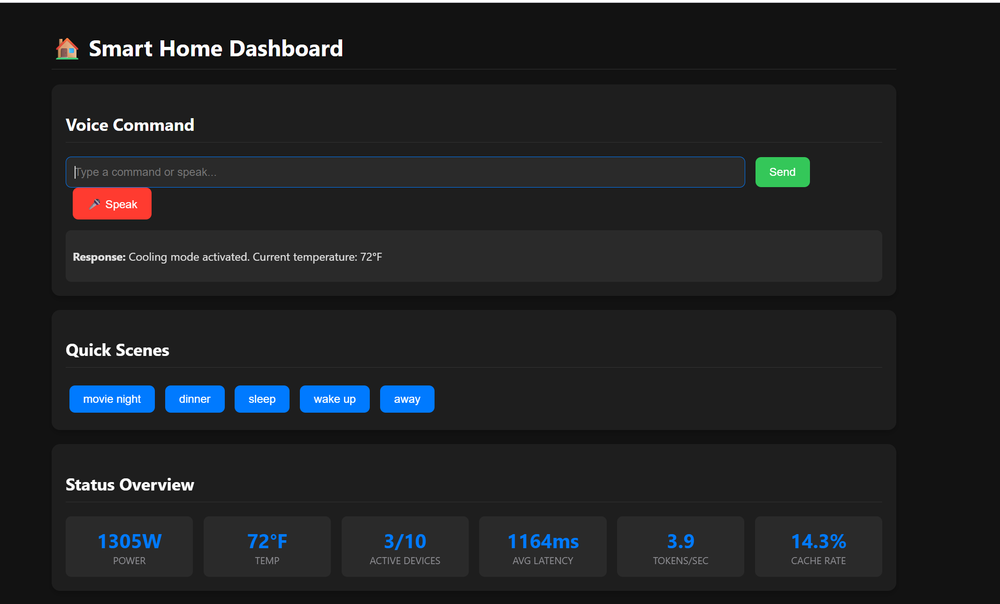
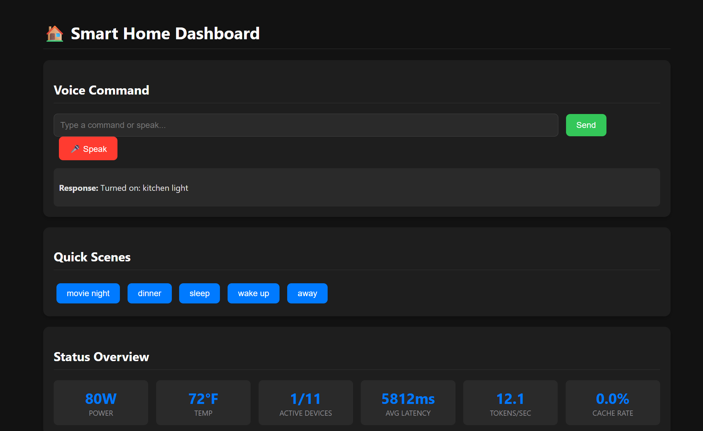
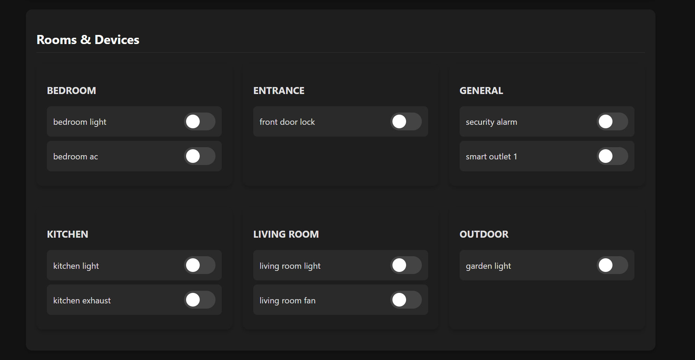
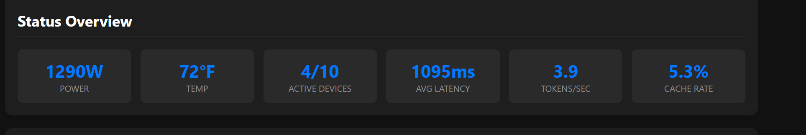

# Edge AI Smart Home Assistant

# 



=======
This project is a sophisticated, privacy-focused smart home assistant designed to run locally on ARM-based edge devices like the NVIDIA Jetson or Raspberry Pi. It uses a local Ollama instance for natural language understanding, allowing for complex and conversational command processing without relying on cloud services. The assistant can control GPIO-connected devices, manage energy usage, and be controlled via a command-line interface or a web-based dashboard with a full API.

# 🤖 Edge AI on ARM Architecture

This project serves as a powerful demonstration of Edge AI running efficiently on the ARM architecture. By leveraging ARM-based single-board computers (like the NVIDIA Jetson or Raspberry Pi), we can run a sophisticated language model locally, bringing the power of AI to the edge with significant advantages:

> > > > > > > 9bd2d6710c3959d9e100debc3b4ce5d7f89e40de

A **privacy-focused, local-first smart home assistant** designed for ARM-based edge devices (NVIDIA Jetson, Raspberry Pi). Powered by Ollama and Deepseek, it delivers conversational AI, direct hardware control, and intelligent automation—**all without the cloud**.

---

## 🚀 Key Features

- **Local AI Inference:** All natural language processing runs on-device using Ollama and Deepseek.
- **Privacy & Security:** No data leaves your local network.
- **Low Latency:** Instant responses—no cloud round-trips.
- **Direct GPIO Control:** Manage lights, fans, and more via GPIO pins.
- **Web Dashboard & API:** Clean web UI and REST API for control and monitoring.
- **Energy Management:** Proactively saves energy by turning off unused devices.
- **Custom Scenes & Automations:** Easily define and trigger complex routines.
- **Performance Monitoring:** Real-time metrics for LLM speed and command latency.

---

=======

A **privacy-focused, local-first smart home assistant** designed for ARM-based edge devices (NVIDIA Jetson, Raspberry Pi). Powered by Ollama and Deepseek, it delivers conversational AI, direct hardware control, and intelligent automation—**all without the cloud**.

---

## 🚀 Key Features

- **Local AI Inference:** All natural language processing runs on-device using Ollama and Deepseek.
- **Privacy & Security:** No data leaves your local network.
- **Low Latency:** Instant responses—no cloud round-trips.
- **Direct GPIO Control:** Manage lights, fans, and more via GPIO pins.
- **Web Dashboard & API:** Clean web UI and REST API for control and monitoring.
- **Energy Management:** Proactively saves energy by turning off unused devices.
- **Custom Scenes & Automations:** Easily define and trigger complex routines.
- **Performance Monitoring:** Real-time metrics for LLM speed and command latency.

---

> > > > > > > 6c6dbea60d5dfb7663f8f784c75932b6f31a157f

## 🖥️ Web Dashboard & API

=======

# ✨ Features

Local First, Privacy-Focused: All command processing is done locally using Ollama.

> > > > > > > 9bd2d6710c3959d9e100debc3b4ce5d7f89e40de



- **Voice & Text Commands:** Interact naturally.
- **Device Control:** Toggle, monitor, and automate devices.
- **Status Reports:** Real-time device and system status.

**API Endpoints:**

- `GET /` — Main dashboard
- `POST /api/command` — Process text/voice commands
- `GET /api/status` — Device/context status
- `POST /api/device/toggle` — Toggle device
- `POST /api/scene/activate` — Activate scene

---

## 📊 Performance Metrics

<<<<<<< HEAD
<<<<<<< HEAD
=======

> > > > > > > 6c6dbea60d5dfb7663f8f784c75932b6f31a157f

# 

# 🖥️ Web Dashboard & API

The assistant includes a web-based dashboard and a comprehensive API, allowing for easy control and monitoring of your smart home.

> > > > > > > 9bd2d6710c3959d9e100debc3b4ce5d7f89e40de

| Metric         | Value    | Description                           |
| -------------- | -------- | ------------------------------------- |
| Tokens/Second  | ~12.0    | Deepseek LLM generation speed         |
| Avg. Latency   | ~1–8s    | Command processing time               |
| Power Usage    | ~60–140W | Depends on active devices             |
| Cache Hit Rate | ~5–15%   | Reduces latency for repeated commands |

---

## ⚡ Getting Started

### Prerequisites

- ARM-based SBC (NVIDIA Jetson, Raspberry Pi)
- Python 3.8+
- Compatible GPIO library (e.g., Jetson.GPIO, RPi.GPIO)

### Installation

```bash
git clone https://github.com/fidel-makatia/EdgeAI_Ollama.git
cd EdgeAI_Ollama

python3 -m venv smart_home_env
source smart_home_env/bin/activate

curl -fsSL https://ollama.com/install.sh | sh
ollama pull deepseek-r1:7b  # Recommended model

# Optional: Try other models
ollama pull llama2:7b
ollama pull mistral:7b
ollama pull phi:2.7b

pip install ollama flask flask-cors schedule Jetson.GPIO
# Optional: For environmental sensors
pip install adafruit-circuitpython-dht
```

### Running the Assistant

```bash
# Default model
python3 smart_home_assistant.py

# Specify model
python3 smart_home_assistant.py --model llama2:7b

# Custom web port
python3 smart_home_assistant.py --port 8080

# CLI only
python3 smart_home_assistant.py --no-api
```

Access the dashboard at:  
`http://<your-device-ip>:5000` (or your custom port)

---

## ⚙️ Usage Example

**CLI Interaction:**

```
You: I'm cold
🤔 Using Deepseek model for command...
🤖 LLM Raw Output: {
    "intent": "set_temperature",
    "devices": null,
    "scene": null,
    "value": "increase",
    "reasoning": "User is cold, so I will increase the temperature. This will turn on heaters and turn off ACs."
}
🤖 Assistant: Heating mode activated. Current temperature: 72°F
💭 Logic: User is cold, so I will increase the temperature. This will turn on heaters and turn off ACs.
⏱️ [1234ms]
```

**Special Commands:**

- `status` — Full device/context report
- `perf` — Performance metrics
- `help` — Command types
- `quit` — Shut down

---

## 📂 File Structure

```
EdgeAI_Ollama/
├── assets/
│   ├── UI1.png
│   ├── UI2.png
│   ├── UI3.png
│   └── stats.png
├── smart_home_assistant.py   # Main application
├── requirements.txt          # Python dependencies
└── README.md                 # Project documentation
```

---

## 🔧 Configuration

All configuration is handled in `smart_home_assistant.py`.

### Adding a Device

In `_init_devices`, add to `self.devices`:

```python
'office_light': Device(
        name='office_light',
        pin=33,
        device_type=DeviceType.LIGHT,
        aliases=['office light', 'desk lamp'],
        room='office',
        power_consumption=15
),
```

### Creating a Scene

In `_init_automation_rules`, add to `self.scenes`:

```python
'work_mode': {
        'devices': {
                'office_light': True,
                'living_room_light': False,
                'living_room_fan': False,
        },
        'description': 'Sets up the office for work.'
},
```

---

## 🛠️ Technology Stack

- **Backend:** Python 3
- **Web:** Flask
- **NLP:** Ollama + Deepseek
- **Hardware:** Jetson.GPIO (or compatible)
- **Scheduling:** schedule
- **Frontend:** HTML, CSS, JavaScript (no frameworks)

---

## 🤝 Contributing

Contributions are welcome!

1. Fork the repo
2. Create a branch: `git checkout -b feature/your-feature`
3. Make changes
4. Commit: `git commit -m 'Add some feature'`
5. Push and open a pull request

---

**Bring powerful, private AI to your home—on your terms.**
